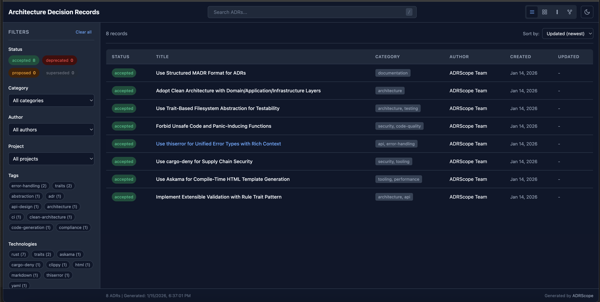

# ADRScope

[](https://github.com/zircote/adrscope/actions/workflows/ci.yml)
[](https://crates.io/crates/adrscope)
[](https://docs.rs/adrscope)
[](https://www.rust-lang.org/)
[](LICENSE)
[](https://github.com/EmbarkStudios/cargo-deny)

A lightweight visualization tool for Architecture Decision Records (ADRs).

ADRScope generates self-contained HTML viewers for ADRs following the [structured-MADR](https://adr.github.io/madr/) format. It supports faceted search, relationship graphs, and GitHub Wiki generation.

## Screenshots

### Main Viewer


### ADR Details with Relationship Graph
| ADR Content View | Category Breakdown |
|:----------------:|:------------------:|
|  |  |

### Faceted Search & Filtering
| Filter Panel | Filtered Results |
|:------------:|:----------------:|
|  |  |

## Features

- **Self-contained HTML viewer** - Single file with embedded CSS/JS, no dependencies
- **Faceted search** - Filter by status, category, tags, author, project, and technologies
- **Relationship graphs** - Interactive visualization of ADR relationships
- **Multiple themes** - Light, dark, and system-preference modes
- **GitHub Wiki generation** - Generate wiki pages with index, status, category, and timeline views
- **Validation** - Check ADRs for required and recommended fields
- **Statistics** - Analyze your ADR collection with detailed breakdowns
- **Lenient parsing** - Gracefully handles non-standard status values with warnings

## Installation

### From crates.io

```bash
cargo install adrscope
```

### From source

```bash
git clone https://github.com/zircote/adrscope.git
cd adrscope
make install
```

## Quick Start

```bash
# Generate an HTML viewer from ADRs in docs/decisions
adrscope generate -i docs/decisions -o adr-viewer.html

# Validate ADRs (useful for CI/CD)
adrscope validate -i docs/decisions --strict

# Show statistics
adrscope stats -i docs/decisions

# Generate GitHub Wiki pages
adrscope wiki -i docs/decisions -o wiki/
```

## Documentation

- [Getting Started Guide](docs/getting-started.md)
- [User Guide](docs/user-guide.md)
- [Configuration Reference](docs/configuration.md)
- [Architecture Decision Records](docs/decisions/)

## Commands

| Command | Description |
|---------|-------------|
| `generate` | Generate self-contained HTML viewer |
| `validate` | Validate ADRs against rules |
| `stats` | Show ADR statistics |
| `wiki` | Generate GitHub Wiki pages |

### Generate Options

```bash
adrscope generate [OPTIONS]

Options:
  -i, --input <DIR>     Input directory [default: docs/decisions]
  -o, --output <FILE>   Output HTML file [default: adr-viewer.html]
  -p, --pattern <GLOB>  File pattern [default: **/*.md]
  -t, --theme <THEME>   Theme: light, dark, system [default: system]
  -v, --verbose         Enable verbose output
```

### Validate Options

```bash
adrscope validate [OPTIONS]

Options:
  -i, --input <DIR>     Input directory [default: docs/decisions]
  -p, --pattern <GLOB>  File pattern [default: **/*.md]
  --strict              Fail on warnings (for CI/CD)
  --json                Output as JSON
  -v, --verbose         Enable verbose output
```

## ADR Format

ADRScope expects ADRs with YAML frontmatter following the structured-MADR format:

```markdown
---
title: Use PostgreSQL for Data Storage
description: Decision to use PostgreSQL as our primary database
status: accepted
category: architecture
tags:
  - database
  - postgresql
created: 2025-01-15
author: Architecture Team
related:
  - adr-0001.md
  - adr-0003.md
---

## Context

[Describe the context and problem...]

## Decision

[Describe the decision...]

## Consequences

[Describe the consequences...]
```

### Supported Status Values

| Status | Description |
|--------|-------------|
| `proposed` | Under discussion (default) |
| `accepted` | Approved and in effect |
| `deprecated` | Should not be used for new work |
| `superseded` | Replaced by another ADR |

Unknown status values are handled gracefully with a warning.

## Library Usage

```rust
use adrscope::application::{GenerateOptions, GenerateUseCase};
use adrscope::infrastructure::fs::RealFileSystem;

let fs = RealFileSystem::new();
let use_case = GenerateUseCase::new(fs);
let options = GenerateOptions::new("docs/decisions")
    .with_output("adr-viewer.html");

let result = use_case.execute(&options)?;
println!("Generated viewer with {} ADRs", result.adr_count);
```

## Development

### Prerequisites

- Rust 1.85+ (2024 edition)
- [cargo-deny](https://github.com/EmbarkStudios/cargo-deny) for supply chain security

### Build Commands

```bash
make build      # Build debug binary
make release    # Build optimized binary
make test       # Run all tests
make lint       # Run clippy linter
make fmt        # Format code
make check      # Quick check (fmt + lint + test)
make ci         # Full CI pipeline
make install    # Install to ~/.cargo/bin
```

### Code Quality

- **Linting**: clippy with pedantic and nursery lints
- **Safety**: `#![forbid(unsafe_code)]`
- **Testing**: 180+ tests with 95%+ coverage
- **Supply Chain**: cargo-deny for dependency auditing

## MSRV Policy

The Minimum Supported Rust Version (MSRV) is **1.85**. Increasing the MSRV is considered a minor breaking change.

## Contributing

1. Fork the repository
2. Create a feature branch (`git checkout -b feature/amazing-feature`)
3. Run checks (`make check`)
4. Commit with conventional commits (`git commit -m 'feat: add feature'`)
5. Push and open a Pull Request

## License

This project is licensed under the MIT License - see the [LICENSE](LICENSE) file for details.

## Acknowledgments

- [MADR](https://adr.github.io/madr/) - Markdown ADR format
- [ADR GitHub Organization](https://adr.github.io/) - ADR resources and tools
