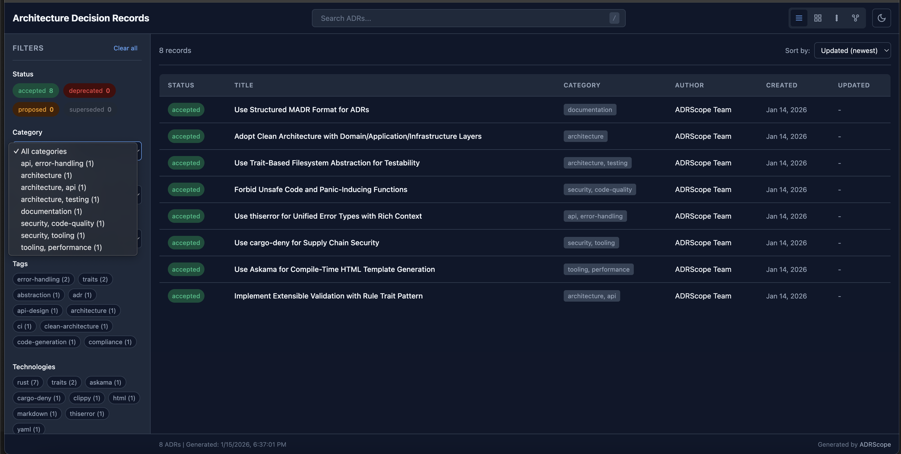

# Getting Started with ADRScope

This guide walks you through installing ADRScope and generating your first ADR viewer.

## Prerequisites

- Rust 1.85 or later
- A directory containing ADRs in Markdown format with YAML frontmatter

## Installation

### From crates.io (Recommended)

```bash
cargo install adrscope
```

### From Source

```bash
git clone https://github.com/zircote/adrscope.git
cd adrscope
cargo install --path .
```

Verify the installation:

```bash
adrscope --version
```

## Your First ADR Viewer

### 1. Prepare Your ADRs

ADRScope expects ADRs with YAML frontmatter. Create a directory for your decisions:

```bash
mkdir -p docs/decisions
```

Create your first ADR (`docs/decisions/adr-0001-example.md`):

```markdown
---
title: Use Markdown for Documentation
description: Decision to use Markdown as our documentation format
status: accepted
category: tooling
tags:
  - documentation
  - markdown
created: 2025-01-15
author: Your Name
---

## Context

We need a lightweight, portable documentation format.

## Decision

We will use Markdown for all documentation.

## Consequences

- Easy to read in plain text
- Widely supported by tools and platforms
- Version control friendly
```

### 2. Generate the Viewer

```bash
adrscope generate -i docs/decisions -o adr-viewer.html
```

### 3. Open the Viewer

Open `adr-viewer.html` in your browser. You'll see an interactive viewer like this:


## Exploring the Viewer

### Filtering ADRs

Use the filter panel on the left to narrow down ADRs by:

- **Status**: proposed, accepted, deprecated, superseded
- **Category**: architecture, tooling, security, etc.
- **Tags**: searchable keywords
- **Author**: decision makers
- **Project**: for multi-project repositories

| Filter Panel | Filtered Results |
|:------------:|:----------------:|
|  |  |

### Viewing ADR Details

Click any ADR to see its full content and relationship graph:

| ADR Content View | Category Breakdown |
|:----------------:|:------------------:|
|  |  |

## Next Steps

- Read the [User Guide](user-guide.md) for detailed command documentation
- Check the [Configuration Reference](configuration.md) for customization options
- Explore the [Architecture Decision Records](decisions/) documenting ADRScope itself
